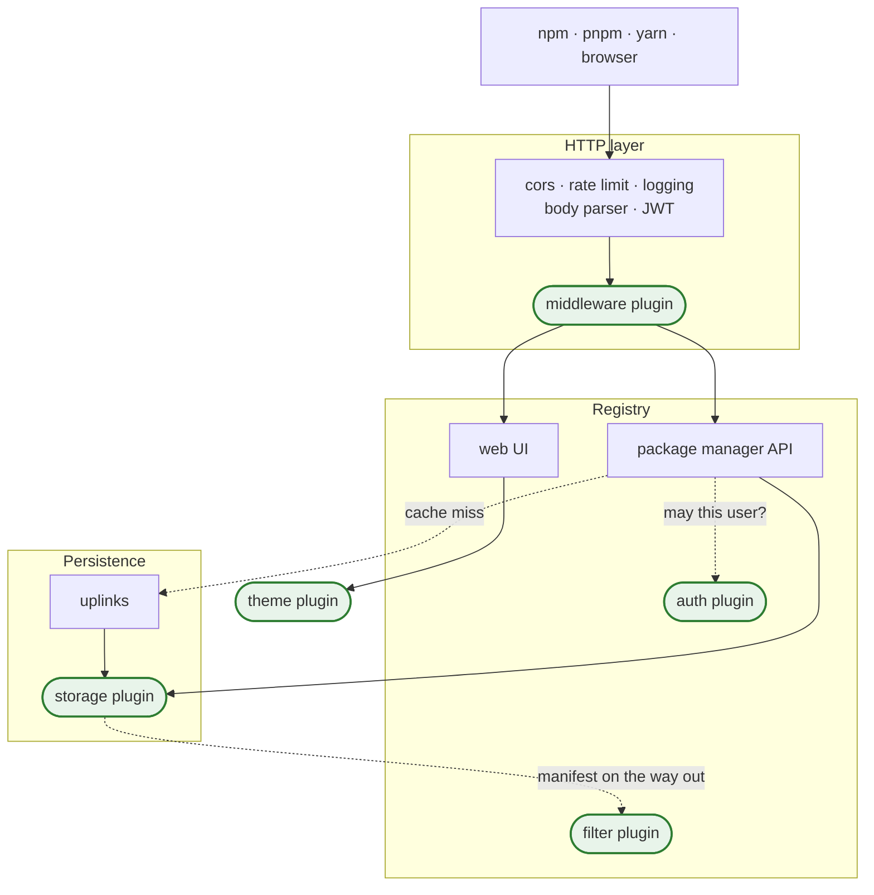

Verdaccio ships with sensible defaults: users in an `htpasswd` file, packages on local disk,
the bundled web UI. A plugin is how you replace one of those parts without forking anything —
the registry keeps doing everything else, and your code owns one well-defined job.

## Do you need one? {#do-you-need-one}

Quite often, no. Check the configuration first: uplinks, the `packages:` access rules,
notifications, rate limiting and the web UI options cover most of what people reach for a
plugin to do, and a config change is something you can revert in a minute.

Write a plugin when the answer has to come from **your** system:

- Your company already knows who its developers are, in LDAP, an OIDC provider or an
  in-house service, and you do not want a second list of users to keep in sync.
- Your artifacts have to live somewhere you already operate — S3, GCS, a NAS — because of
  durability, cost or a compliance rule.
- Several registry instances must share state, which local disk cannot do.
- You need an endpoint the registry does not have, or one of its responses adjusted before
  clients see it.
- The UI has to look like the rest of your internal tooling.

## Where a plugin plugs in {#where}

Verdaccio is one Express application with five points where your code can take over. Nothing
else changes: the registry keeps serving, caching and proxying around you.



Reading it as a request:

1. A request arrives and passes Verdaccio's own layers — CORS, rate limiting, the body parser,
   the JWT that resolves `req.remote_user`.
2. **Middleware plugins** see it next, _before_ the registry API, so they can add endpoints or
   intercept existing ones.
3. The API asks **auth plugins** whether this user may read, publish or unpublish.
4. It reads and writes through the **storage plugin** — the only one Verdaccio cannot do
   without a default for — falling back to **uplinks** on a cache miss.
5. Manifests pass through **filter plugins** before they reach the client.
6. Anything aimed at the web UI is rendered by the **theme plugin**.

## The five kinds {#kinds}

| Plugin                             | Replaces or extends                  | Typical reason                                |
| ---------------------------------- | ------------------------------------ | --------------------------------------------- |
| [Authentication](plugin-auth.md)   | who the user is and what they may do | reuse LDAP, SSO or an internal directory      |
| [Storage](plugin-storage.md)       | where manifests and tarballs live    | object storage, shared state across instances |
| [Middleware](plugin-middleware.md) | the HTTP layer                       | extra endpoints, intercepting existing ones   |
| [Theme](plugin-theme.md)           | the web UI                           | your own branding or a different interface    |
| [Filter](plugin-filter.md)         | package metadata on its way out      | hide versions by policy                       |

You can run several at once, and several of the same kind: auth plugins form a chain, filters
run in sequence. Storage and theme are the exceptions — only one of each is used.

## What you are signing up for {#expectations}

Two of the five are harder than they look, and it is fairer to say so up front.

**Storage** sits on the request path for every publish and install, which means streams,
abort handling and error paths that take the process down when you get them wrong. Read the
[lifecycle section](plugin-storage.md#lifecycle) before you start, and treat
[`verdaccio-aws-s3-storage`](https://github.com/verdaccio/verdaccio-aws-s3-storage) and
[`verdaccio-google-cloud`](https://github.com/verdaccio/verdaccio-google-cloud) as the
reference: both hit those failures in the field and carry a regression test for each.

**Authentication** is a chain with semantics that surprise people — a plugin answering "no"
does not veto, it defers to the next one. The
[chaining rules](plugin-auth.md#chaining) are worth reading before you rely on a plugin to
deny anything.

Middleware, theme and filter are comparatively small jobs.

## Getting started {#getting-started}

Run the [plugin generator](plugin-generator.md). It scaffolds a project that already compiles
against the current interfaces, which saves you the most common first problem — the types
moved names between major versions, and old tutorials still use the old ones.

Two checks are worth running from the start, and the scaffold wires both: `npm run build`
type-checks against the real interfaces, and `npm run verify` uses
[the plugin verifier](plugin-verifier.md) to confirm Verdaccio can actually load what you
built — a broken export is not something the compiler catches.

The contracts themselves live in `pluginUtils` in
[`@verdaccio/core`](https://github.com/verdaccio/verdaccio/blob/master/packages/core/core/src/plugin-utils.ts);
that file is the authority when a doc page and your compiler disagree.

### Which version of `@verdaccio/core` to depend on {#core-version}

```bash
npm i -D @verdaccio/core@latest   # building against 6.x
npm i -D @verdaccio/core@next-9   # building against 7.x
```

:::caution Do not use the tag named after the line
`6-next` and `next-7` look like the obvious choices and are both **wrong**. They are left
over from prereleases those lines stopped using years ago, and nothing updates them, so
installing one compiles you against interfaces that have since moved. They do not fail —
they just give you something old.

The tags that track what actually ships are:

| Building against | The `verdaccio` binary | `@verdaccio/*` packages and plugins |
| ---------------- | ---------------------- | ----------------------------------- |
| **6.x**          | `latest`               | **`latest`**                        |
| **7.x**          | `next-7`               | **`next-9`**                        |

Only the binary is tagged after its own line. The packages it is built from are versioned
independently, so `verdaccio@6.10.4` depends on `@verdaccio/core@8.3.0` (`latest`) and
`verdaccio@7.0.0-next-7.28` depends on `@verdaccio/core@9.0.0-next-9.31` (`next-9`). For
comparison, `@verdaccio/core@6-next` is still `6.0.0-6-next.1`.
:::

The [plugin search](/dev/plugins-search) lists what the community already published — worth a
look before writing, and a good source of working examples either way.
