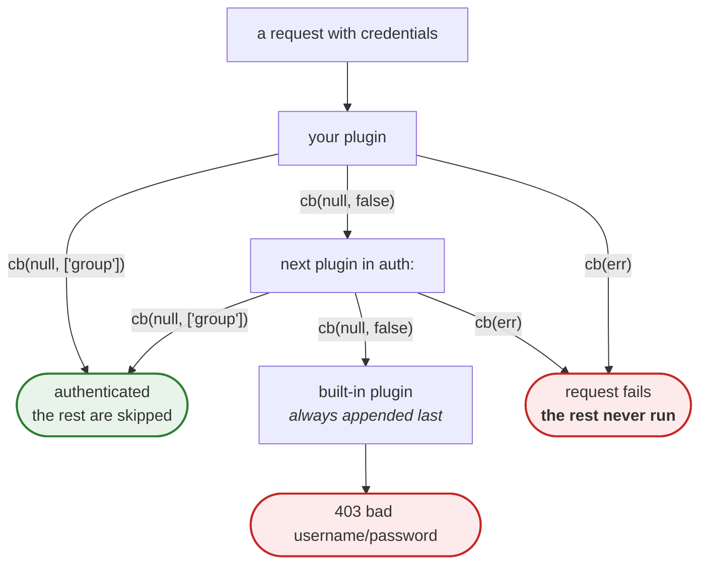
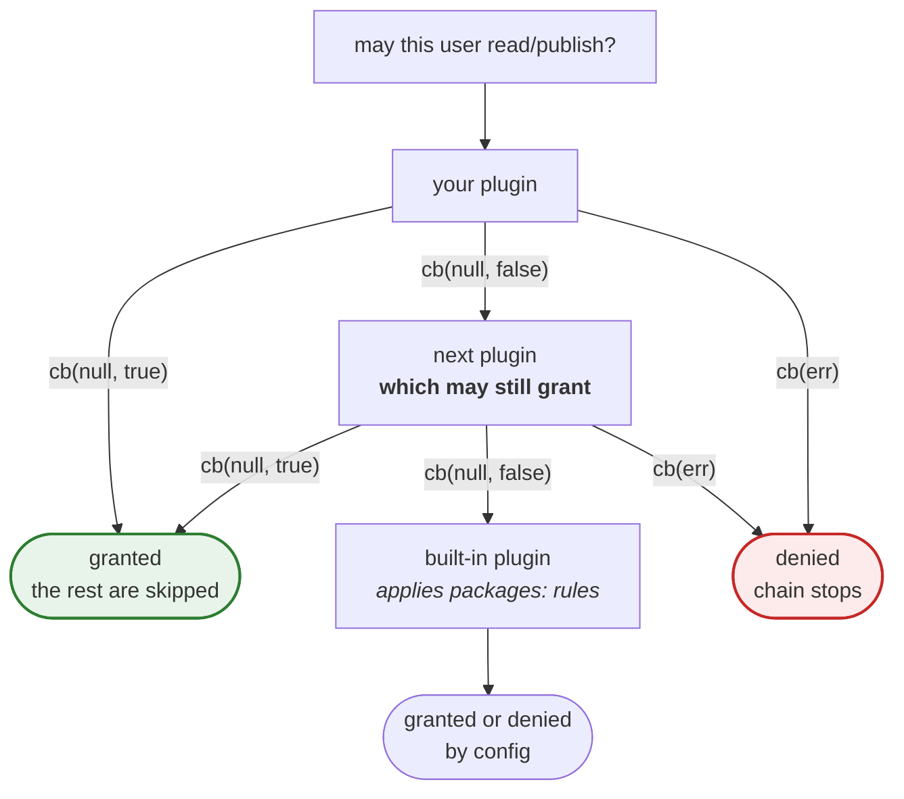

```mdx-code-block
import CodeBlock from '@theme/CodeBlock';
import AuthExample from '!!raw-loader!./examples/auth-plugin.ts';
```

## What's an authentication plugin? {#whats-an-authentication-plugin}

A plugin that decides who can access or publish a given package. By default the `htpasswd` is built-in, but can
easily be replaced by your own.

## Getting Started

The authentication plugins are defined in the `auth:` section, as follows:

```yaml
auth:
  htpasswd:
    file: ./htpasswd
```

also multiple plugins can be chained:

```yaml
auth:
  htpasswd:
    file: ./htpasswd
  anotherAuth:
    foo: bar
    bar: foo
  lastPlugin:
    foo: bar
    bar: foo
```

### How the chain works {#chaining}

Plugins are consulted **in the order they appear in `auth:`**, and Verdaccio appends its own
built-in plugin at the end — that last one is what terminates the chain, so it always ends.

What "resolve the request" means is not the same for authentication and for permissions, and
the difference is where chained setups usually go wrong.

#### The chain, at a glance {#chaining-diagram}



The red path is the one that surprises people: **an error is not "try the next one"**, it ends
the chain. `false` is how you say "not mine".

For `allow_access` and friends the shape is the same but the roles swap — `true` is what stops
the chain, and `false` hands the decision on:



#### `authenticate` — first success wins {#chaining-authenticate}

| Your plugin calls                                 | What happens                                                   |
| ------------------------------------------------- | -------------------------------------------------------------- |
| `cb(null, ['group-a'])`                           | authenticated, the remaining plugins are skipped               |
| `cb(null, false)` — or an empty/absent group list | **not a failure**: the next plugin is tried                    |
| `cb(err)`                                         | **the chain stops here** and the request fails with that error |
| _(no `authenticate` method)_                      | the plugin is skipped                                          |

If nobody authenticates, the built-in plugin answers `403 bad username/password`.

:::caution
An error **aborts the chain**. If your LDAP is unreachable and you answer
`errorUtils.getInternalError(...)`, an `htpasswd` plugin listed after it is never consulted
and every login fails. Answer `false` when you simply cannot vouch for this user; keep errors
for "nobody else should decide either".
:::

Returning a string instead of an array of groups throws a `TypeError` at runtime.

#### `allow_access` and friends — first grant wins {#chaining-access}

`allow_access`, `allow_publish`, `allow_unpublish` and `allow_stage` all behave the same way:

| Your plugin calls     | What happens                                  |
| --------------------- | --------------------------------------------- |
| `cb(null, true)`      | granted, the remaining plugins are skipped    |
| `cb(null, false)`     | **not a veto**: the next plugin is asked      |
| `cb(err)`             | denied with that error, the chain stops       |
| `cb(null, undefined)` | `allow_stage` only: defers to `allow_publish` |

:::caution
**You cannot deny with `false`.** A plugin answering `false` only steps aside, and a later
plugin — including the built-in one, which applies the `packages:` block — can still grant
the request. A hard denial has to be an error.
:::

## How do the authentication plugin works? {#how-do-the-authentication-plugin-works}

Basically we have to return an object with a single method called `authenticate` that will receive 3 arguments (`user, password, callback`).

On each request, `authenticate` will be triggered and the plugin should return the credentials, if the `authenticate` fails, it will fallback to the `$anonymous` role by default.

### API {#api}

The interface lives in `@verdaccio/core`, under the `pluginUtils` namespace. Unlike storage,
authentication is still callback-based:

```typescript
import { pluginUtils } from '@verdaccio/core';

interface Auth<T> extends Plugin<T> {
  authenticate(user: string, password: string, cb: AuthCallback): void;
  adduser?(user: string, password: string, cb: AuthUserCallback): void;
  changePassword?(
    user: string,
    password: string,
    newPassword: string,
    cb: AuthChangePasswordCallback
  ): void;
  allow_publish?(user: RemoteUser, pkg: AllowAccess & PackageAccess, cb: AuthAccessCallback): void;
  allow_access?(user: RemoteUser, pkg: AllowAccess & PackageAccess, cb: AccessCallback): void;
  allow_unpublish?(
    user: RemoteUser,
    pkg: AllowAccess & PackageAccess,
    cb: AuthAccessCallback
  ): void;
  allow_stage?(user: RemoteUser, pkg: AllowAccess & PackageAccess, cb: AuthAccessCallback): void;
  apiJWTmiddleware?(helpers: any): RequestHandler;
}
```

> Only `adduser`, `allow_access`, `apiJWTmiddleware`, `allow_publish`, `allow_unpublish` and `allow_stage` are optional, verdaccio provide a fallback in all those cases.

`allow_stage` gates `npm stage publish`. Answering `undefined` defers to `allow_publish`,
which is what the built-in plugin does when the packages configuration has no `stage` entry.

### A complete plugin {#example}

<CodeBlock language="ts">{AuthExample}</CodeBlock>

#### `apiJWTmiddleware` method {#apijwtmiddleware-method}

`apiJWTmiddleware` was introduced on [PR#1227](https://github.com/verdaccio/verdaccio/pull/1227) in order to have full control of the token handler, overriding this method will disable `login/adduser` support. We recommend don't implement this method unless is totally necessary. See a full example [here](https://github.com/verdaccio/verdaccio/pull/1227#issuecomment-463235068).

### Error messages come from `API_ERROR` {#api-error}

`@verdaccio/core` exports `API_ERROR`, a list of the messages the registry already uses —
`BAD_USERNAME_PASSWORD`, `NO_CREDENTIALS_PROVIDED`, `MAX_USERS_REACHED`,
`REGISTRATION_DISABLED`, `UNAUTHORIZED_ACCESS` and around forty more.

Most `errorUtils` helpers **already default to the right one**, so the common case takes no
argument at all:

```ts
errorUtils.getUnauthorized(); // → API_ERROR.NO_CREDENTIALS_PROVIDED
errorUtils.getNotFound(); //     → API_ERROR.NO_PACKAGE
errorUtils.getConflict(); //     → API_ERROR.PACKAGE_EXIST
```

Passing a hand-written string usually means retyping a constant, and your plugin's errors then
read differently from the registry's for the same situation. Write your own message only when
nothing in the list fits.

## What should I return in each of the methods? {#what-should-i-return-in-each-of-the-methods}

Verdaccio relies on `callback` functions at time of this writing. Each method should call the method and what you return is important, let's review how to do it.

### `authentication` callback {#authentication-callback}

Once the authentication has been executed there is 2 options to give a response to `verdaccio`.

##### If the authentication fails {#if-the-authentication-fails}

If the auth was unsuccessful, return `false` as the second argument.

```typescript
callback(null, false);
```

##### If the authentication success {#if-the-authentication-success}

The auth was successful.

`groups` is an array of strings where the user is part of.

```
 callback(null, groups);
```

##### If the authentication produce an error {#if-the-authentication-produce-an-error}

The authentication service might fails, and you might want to reflect that in the user response, eg: service is unavailable.

```
 import { API_ERROR, errorUtils } from '@verdaccio/core';

 callback(errorUtils.getInternalError(API_ERROR.RESOURCE_UNAVAILABLE));
```

> A failure on login is not the same as service error, if you want to notify user the credentials are wrong, just return `false` instead string of groups. The behaviour mostly depends of you.

### `adduser` callback {#adduser-callback}

##### If adduser success {#if-adduser-success}

If the service is able to create an user, return `true` as the second argument.

```typescript
callback(null, true);
```

##### If adduser fails {#if-adduser-fails}

Any other action different than success must return an error.

```typescript
import { API_ERROR, errorUtils } from '@verdaccio/core';

const err = errorUtils.getConflict(API_ERROR.MAX_USERS_REACHED);

callback(err);
```

### `changePassword` callback {#changepassword-callback}

##### If the request is successful {#if-the-request-is-successful}

If the service is able to create an user, return `true` as the second argument.

```typescript
const user = serviceUpdatePassword(user, password, newPassword);

callback(null, user);
```

##### If the request fails {#if-the-request-fails}

Any other action different than success must return an error.

```typescript
import { errorUtils } from '@verdaccio/core';

// `API_ERROR` has no entry for an unknown user, and the default for getNotFound is
// NO_PACKAGE — 'no such package available' — which would be misleading here.
const err = errorUtils.getNotFound('user not found');

callback(err);
```

### `allow_access`, `allow_publish`, or `allow_unpublish` callback {#allow_access-allow_publish-or-allow_unpublish-callback}

These methods aims to allow or deny trigger some actions.

##### If the request success {#if-the-request-success}

If the service is able to create an user, return a `true` as the second argument.

```typescript

allow_access(user: RemoteUser, pkg: PackageAccess, cb: Callback): void {
  const isAllowed: boolean = checkAction(user, pkg);

  callback(null, isAllowed)
}
```

##### If the request fails {#if-the-request-fails-1}

Any other action different than success must return an error.

```typescript
import { API_ERROR, errorUtils } from '@verdaccio/core';

const err = getForbidden('not allowed to access package');

callback(err);
```

## Generate an authentication plugin {#generate-an-authentication-plugin}

For detailed info check our [plugin generator page](plugin-generator.md). Run the `yo` command in your terminal and follow the steps.

```
➜ yo verdaccio-plugin

Just found a `.yo-rc.json` in a parent directory.
Setting the project root at: /Users/user/verdaccio_yo_generator

     _-----_     ╭──────────────────────────╮
    |       |    │        Welcome to        │
    |--(o)--|    │ generator-verdaccio-plug │
   `---------´   │   in plugin generator!   │
    ( _´U`_ )    ╰──────────────────────────╯
    /___A___\   /
     |  ~  |
   __'.___.'__
 ´   `  |° ´ Y `

? What is the name of your plugin? service-name
? Select Language typescript
? What kind of plugin you want to create? auth
? Please, describe your plugin awesome auth plugin
? GitHub username or organization myusername
? Author's Name Juan Picado
? Author's Email jotadeveloper@gmail.com
? Key your keywords (comma to split) verdaccio,plugin,auth,awesome,verdaccio-plugin
   create verdaccio-plugin-authservice-name/package.json
   create verdaccio-plugin-authservice-name/.gitignore
   create verdaccio-plugin-authservice-name/.npmignore
   create verdaccio-plugin-authservice-name/jest.config.js
   create verdaccio-plugin-authservice-name/.babelrc
   create verdaccio-plugin-authservice-name/.travis.yml
   create verdaccio-plugin-authservice-name/README.md
   create verdaccio-plugin-authservice-name/.eslintrc
   create verdaccio-plugin-authservice-name/.eslintignore
   create verdaccio-plugin-authservice-name/src/index.ts
   create verdaccio-plugin-authservice-name/index.ts
   create verdaccio-plugin-authservice-name/tsconfig.json
   create verdaccio-plugin-authservice-name/types/index.ts
   create verdaccio-plugin-authservice-name/.editorconfig

I'm all done. Running npm install for you to install the required dependencies. If this fails, try running the command yourself.


⸨ ░░░░░░░░░░░░░░░░░⸩ ⠋ fetchMetadata: sill pacote range manifest for @babel/plugin-syntax-jsx@^7.7.4 fetc
```

After the install finish, access to your project scalfold.

```
➜ cd verdaccio-plugin-service-name
➜ cat package.json

  {
  "name": "verdaccio-plugin-service-name",
  "version": "0.0.1",
  "description": "awesome auth plugin",
  ...
```

## Full implementation ES5 example {#full-implementation-es5-example}

```javascript
function Auth(config, stuff) {
  var self = Object.create(Auth.prototype);
  self._users = {};

  // config for this module
  self._config = config;

  // verdaccio logger
  self._logger = stuff.logger;

  // pass verdaccio logger to ldapauth
  self._config.client_options.log = stuff.logger;

  return self;
}

Auth.prototype.authenticate = function (user, password, callback) {
  var LdapClient = new LdapAuth(self._config.client_options);
  ....
  LdapClient.authenticate(user, password, function (err, ldapUser) {
    ...
    var groups;
     ...
    callback(null, groups);
  });
};

module.exports = Auth;
```

And the configuration will looks like:

```yaml
auth:
  htpasswd:
    file: ./htpasswd
```

Where `htpasswd` is the sufix of the plugin name. eg: `verdaccio-htpasswd` and the rest of the body would be the plugin configuration params.

### List Community Authentication Plugins {#list-community-authentication-plugins}

- [verdaccio-bitbucket](https://github.com/idangozlan/verdaccio-bitbucket): Bitbucket authentication plugin for verdaccio.
- [verdaccio-bitbucket-server](https://github.com/oeph/verdaccio-bitbucket-server): Bitbucket Server authentication plugin for verdaccio.
- [verdaccio-ldap](https://www.npmjs.com/package/verdaccio-ldap): LDAP auth plugin for verdaccio.
- [verdaccio-active-directory](https://github.com/nowhammies/verdaccio-activedirectory): Active Directory authentication plugin for verdaccio
- [verdaccio-gitlab](https://github.com/bufferoverflow/verdaccio-gitlab): use GitLab Personal Access Token to authenticate
- [verdaccio-gitlab-ci](https://github.com/lab360-ch/verdaccio-gitlab-ci): Enable GitLab CI to authenticate against verdaccio.
- [verdaccio-htpasswd](https://github.com/verdaccio/verdaccio-htpasswd): Auth based on htpasswd file plugin (built-in) for verdaccio
- [verdaccio-github-oauth](https://github.com/aroundus-inc/verdaccio-github-oauth): Github oauth authentication plugin for verdaccio.
- [verdaccio-github-oauth-ui](https://github.com/n4bb12/verdaccio-github-oauth-ui): GitHub OAuth plugin for the verdaccio login button.
- [verdaccio-groupnames](https://github.com/deinstapel/verdaccio-groupnames): Plugin to handle dynamic group associations utilizing `$group` syntax. Works best with the ldap plugin.
- [verdaccio-sqlite](https://github.com/bchanudet/verdaccio-sqlite): SQLite Authentication plugin for Verdaccio
- [verdaccio-static-token](https://github.com/Eomm/verdaccio-static-token): Static Token plugin for Verdaccio
- [verdaccio-okta-auth](https://github.com/hogarthww-labs/verdaccio-okta-auth) Verdaccio Okta Auth
- [verdaccio-azure-ad-login](https://github.com/IhToN/verdaccio-azure-ad-login) Let your users authenticate into Verdaccio via Azure AD OAuth 2.0 API
- [verdaccio-auth-gitlab](https://github.com/pfdgithub/verdaccio-auth-gitlab) Verdaccio authentication plugin by gitlab personal access tokens.
- [verdaccio-api-token](https://github.com/practical-at/verdaccio-api-token) Authentication plugin for dynamic AuthTokens validated by a custom Endpoint.

**Have you developed a new plugin? Add it here !**
