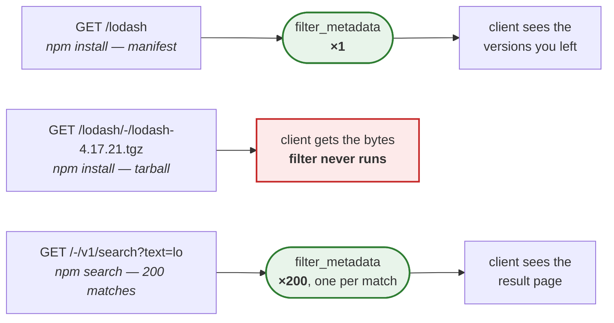

```mdx-code-block
import CodeBlock from '@theme/CodeBlock';
import FilterExample from '!!raw-loader!./examples/filter-plugin.ts';
```

## What's a filter plugin? {#whats-a-filter-plugin}

### When to use a filter plugin? {#when-to-use}

Use one when the metadata a client receives has to differ from what is stored: hiding versions
by policy, rewriting a field, enforcing an internal rule on what may be installed.

**Every manifest request goes through it. Tarball, user, profile and token requests do not.**

### What that looks like per command {#per-command}



Two consequences, and both bite people:

- **A hidden version is still downloadable.** Removing it from `versions` only changes what the
  manifest advertises; the tarball route never consults a filter, so anyone who knows the URL
  gets the file. A filter is a presentation rule, not an access control — that is what
  [auth plugins](plugin-auth.md) are for.
- **Search multiplies the cost.** A single search that matches two hundred packages calls your
  filter two hundred times before answering. This is why the [caveats](#caveats) below insist on
  bailing out before doing any work.

A worked example to read is [verdaccio-plugin-secfilter](https://github.com/Ansile/verdaccio-plugin-secfilter).

### Plugin structure {#build-structure}

The plugin only has one async method named `filter_metadata` that reference of the manifest and must return a copy (or modified object but not recommended) of the metadata.

<CodeBlock language="ts">{FilterExample}</CodeBlock>

## Caveats {#caveats}

Filters look like the cheapest plugin type and are the easiest to make expensive. Everything
here comes from problems that were actually hit and fixed in
[`@verdaccio/package-filter`](https://github.com/verdaccio/verdaccio/tree/master/packages/plugins/package-filter),
which is worth reading as the reference implementation.

### It runs on the hot path, and `npm search` multiplies it {#hot-path}

`filter_metadata` is called for every manifest read. It is also called **once per matched
package** while serving `/-/v1/search` (`packages/store/src/storage.ts`), so a search that
matches two hundred packages runs your filter two hundred times before answering.

That is what turns an innocent-looking deep clone into a visible slowdown: the cost is
multiplied by the result set, not paid once.

### Bail out before you clone {#fast-path}

The first thing to do is decide whether you have anything to change, and return the manifest
untouched if you do not. The official plugin does exactly this, with the search path named
in the comment:

```ts
// Fast path: when no filter is configured there is nothing this plugin can
// change. Avoid cloning and cleanup for the `npm search` hot path.
if (blockRules.size === 0 && !excludeDeprecated && !earliestDateThreshold) {
  return manifest as Manifest;
}
```

### Clone once, not per pass {#clone-once}

When you do have work, clone the manifest and its mutable containers **once**, then let
every pass operate on that copy. Chaining passes that each clone again is the double work
that is easy to introduce when a filter grows a second rule.

### Hoist per-manifest work out of per-version loops {#hoist}

Anything that depends on the manifest rather than the version — matching the package name
against allow rules, parsing configuration, building a `Date` — belongs above the loop.
Recomputing it for each version is the other double loop, and it scales with packages that
have hundreds of versions.

### The copy you get is shallow {#shallow-copy}

The pipeline hands you `{ ...manifest }`. `versions`, `dist-tags`, `time` and `_distfiles`
are still the **caller's** objects, so editing them in place mutates what Verdaccio later
persists. Clone the containers you touch.

### Removing versions leaves debris {#cleanup}

Deleting entries from `versions` is not the whole job: `dist-tags` can end up pointing at a
version that no longer exists — including `latest`, which breaks `npm install` — and `time`
and `_distfiles` keep orphaned entries. Repair what you break, and only when you actually
filtered something.

### Filters chain, and a failure is silent {#chaining}

Filters run in sequence, each receiving the previous one's output, so their costs add up. If
one throws, Verdaccio logs it and carries on with the last good manifest: a broken filter
**fails open** and quietly serves unfiltered metadata. Do not rely on a filter as a security
boundary.

### No I/O {#no-io}

`filter_metadata` is `async`, which makes a network call look acceptable. On the search path
it is not. Load what you need at startup and keep the filter in memory.

## Configuration {#configuration}

Just add `filters` to the `config.yaml` file and your own plugin options.

```yaml
filters:
  storage-filter-blackwhitelist:
    filter_file: /path/to/file
```

More [info in the PR](https://github.com/verdaccio/verdaccio/pull/1161).
