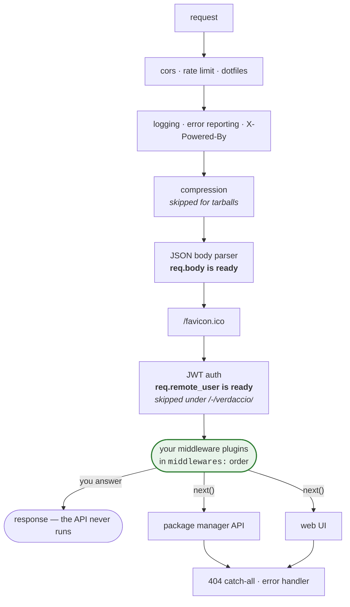

```mdx-code-block
import CodeBlock from '@theme/CodeBlock';
import MiddlewareExample from '!!raw-loader!./examples/middleware-plugin.ts';
```

## What's a Middleware Plugin? {#whats-a-middleware-plugin}

Middleware plugins have the capability to modify the API (web and cli) layer, either adding new endpoints or intercepting requests.

### API {#api}

The interface lives in `@verdaccio/core`, under the `pluginUtils` namespace:

```typescript
import { pluginUtils } from '@verdaccio/core';

interface ExpressMiddleware<PluginConfig, Storage, Auth> extends Plugin<PluginConfig> {
  register_middlewares(app: Express, auth: Auth, storage: Storage): void;
}
```

:::note
The type parameters are declared in the order `<PluginConfig, Storage, Auth>`, but
`register_middlewares` receives **`auth` before `storage`**. The compiler will not catch
the two being swapped when both are `any`.
:::

`Storage` and `Auth` are the types of the instances Verdaccio injects. A plugin that only
needs `auth` can declare `{}` for `Storage`, as the generator template does.

### `register_middlewares` {#register_middlewares}

`app` is the Express application, so the method can mount any router or middleware on it.
`auth` and `storage` are the live instances and can be extended, though we don't recommend
it unless well founded.

<CodeBlock language="ts">{MiddlewareExample}</CodeBlock>

This is the same shape the [plugin generator](plugin-generator.md) scaffolds, so running it
is the quickest way to get a compiling starting point.

> The built-in [`verdaccio-audit`](https://github.com/verdaccio/verdaccio/tree/master/packages/plugins/audit)
> is a real middleware plugin and the shortest one to read.

## Where your middleware runs {#ordering}

Verdaccio builds one Express application and registers everything in this order
(`packages/server/express/src/server.ts`). Since Express runs middleware in registration
order, this is also the order a request travels:



Four consequences are worth spelling out, because they are the ones people get wrong.

### You run before the built-in API, so you can intercept it {#intercepting}

Your routes are registered at step 7 and the registry API at step 8. If your route matches,
you answer and the built-in handler never runs. Mounting `PUT /:package` in a plugin
overrides publishing.

That is easy to do by accident: a broad `app.use()` with no path prefix sees every request.
Mount on a prefix — `app.use('/-/npm/v2/my-endpoint', router)` — unless overriding is what
you want.

### `req.body` is already parsed, on Verdaccio 7 and newer {#body-parser}

The parser at step 4 is `express.json({ strict: false, limit: config.max_body_size })`, so:

- `req.body` is a parsed object by the time your plugin runs, and reading the raw stream
  yourself fails with `stream is not readable`.
- **`max_body_size` from `config.yaml` is your limit too** (default `10mb`). A plugin
  accepting larger payloads needs that raised.
- If a plugin registers its own JSON parser first, Verdaccio detects it and does not add a
  second one.

**On Verdaccio 6 there is no body parser before plugins.** `req.body` is `undefined` and the
plugin has to parse the stream itself, or register `express.json()` on the app.

### `req.remote_user` is populated, except under `/-/verdaccio/` {#remote-user}

The JWT middleware at step 6 exists so plugins can read the authenticated user. It is
deliberately skipped for the web UI namespace (`/-/verdaccio/`), which has its own token
handling — a plugin mounted under that prefix will not see `req.remote_user`.

### Defining `middlewares:` replaces the default list {#audit}

`verdaccio-audit`, which backs `npm audit`, is an ordinary middleware plugin declared in the
default configuration. If you replace the `middlewares:` block with only your own plugin,
audit is gone. Keep it listed:

```yaml
middlewares:
  audit:
    enabled: true
  my-plugin:
    option: value
```

On Verdaccio 7 and newer, audit is loaded automatically **only** when no middleware plugin
is configured at all.

### Errors {#errors}

Call `next(err)` and let the error handler at step 10 format the response; it understands
the errors from `errorUtils` in `@verdaccio/core`. Throwing asynchronously outside a request
handler takes the process down, as it would in any Express app.

## Express 5 route syntax {#express-5}

Verdaccio 7 and newer run **Express 5** (`path-to-regexp` 8); Verdaccio 6 runs Express 4.
Route patterns that were valid in Express 4 now **throw**, and the throw happens while your
plugin is registering — which is during startup.

Nothing catches it. `register_middlewares` is called in a plain loop, so a plugin with an
old-style route **stops Verdaccio from booting**. Unlike a theme plugin, which falls back to
the default, a middleware plugin cannot fail quietly here.

Measured against Express 5.2.1:

| Pattern         | Express 4 | Express 5                                 |
| --------------- | --------- | ----------------------------------------- |
| `/foo/*`        | ok        | ✗ `Missing parameter name at index 6`     |
| `/foo/:id?`     | ok        | ✗ `Unexpected ? at index 8, expected end` |
| `/foo/:id(\d+)` | ok        | ✗ `Unexpected ( at index 8, expected end` |
| `/foo/{*rest}`  | —         | ok, the replacement for `*`               |
| `/foo/*rest`    | —         | ok, a named wildcard                      |
| `/foo{/:id}`    | —         | ok, the replacement for `:id?`            |

So: **wildcards must be named**, **optional segments move into braces**, and **inline regular
expressions are gone** — a pattern like `/:id(\d+)` has to become a plain parameter plus a
check inside the handler.

Verdaccio's own routes are the shortest reference for the new spelling: `/-/static/{*all}`,
`/-/user/token/{*subject}`, `/{*any}`.

The [Express 5 migration guide](https://expressjs.com/en/guide/migrating-5.html) covers the
rest, including `res.sendFile`, which the Verdaccio 7 release notes also flag for plugin
authors.

## Overwriting HTTP Security Headers {#overwrite-http-security-headers]

By default, Verdaccio sets the following HTTP headers. If you have other security requirements, you can overwrite these settings using a middleware plugin (Verdaccio 6.2.5 or higher).

| Header                  | Verdaccio Setting  |
| ----------------------- | ------------------ |
| Content-Security-Policy | connect-src 'self' |
| X-Content-Type-Options  | nosniff            |
| X-Frame-Options         | deny               |
| X-XSS-Protection        | 1; mode=block      |

## Generate a middleware plugin {#generate-a-middleware-plugin}

Run `yo verdaccio-plugin` and pick `middleware` when asked for the plugin type; the
[plugin generator page](plugin-generator.md) covers installation and the full prompt list.
The scaffold it produces is the example shown above, already compiling against the current
`@verdaccio/core`.

### List Community Middleware Plugins {#list-community-middleware-plugins}

- [verdaccio-audit](https://github.com/verdaccio/verdaccio-audit): verdaccio plugin for _npm audit_ cli support (built-in) (compatible since 3.x)

- [verdaccio-profile-api](https://github.com/ahoracek/verdaccio-profile-api): verdaccio plugin for _npm profile_ cli support and _npm profile set password_ for _verdaccio-htpasswd_ based authentificaton

- [verdaccio-https](https://github.com/honzahommer/verdaccio-https) Verdaccio middleware plugin to redirect to https if x-forwarded-proto header is set
- [verdaccio-badges](https://github.com/tavvy/verdaccio-badges) A verdaccio plugin to provide a version badge generator endpoint
- [verdaccio-openmetrics](https://github.com/freight-hub/verdaccio-openmetrics) Verdaccio plugin exposing an OpenMetrics/Prometheus endpoint with health and traffic metrics
- [verdaccio-sentry](https://github.com/juanpicado/verdaccio-sentry) sentry loggin errors
- [verdaccio-pacman](https://github.com/PaddeK/verdaccio-pacman) Verdaccio Middleware Plugin to manage tags and versions of packages
