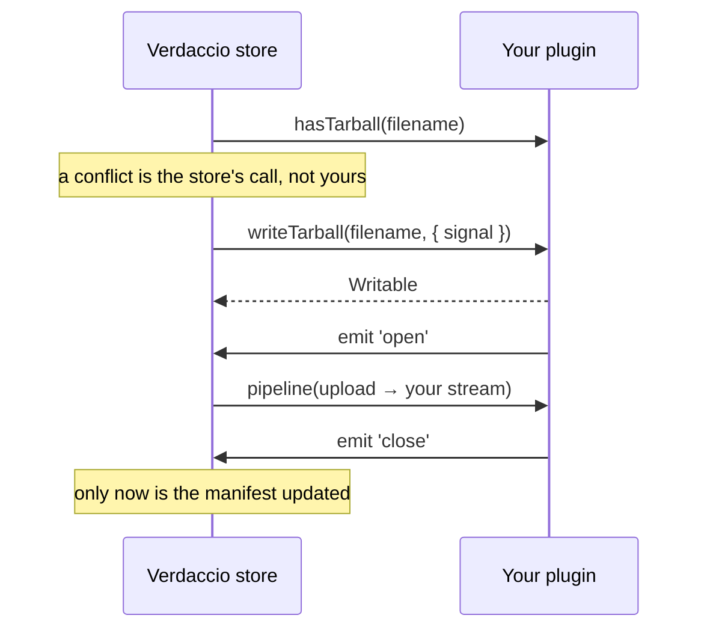

## What's a Storage Plugin? {#whats-a-storage-plugin}

Verdaccio by default uses a file system storage plugin [local-storage](https://github.com/verdaccio/verdaccio/tree/master/packages/plugins/local-storage). The default storage can be easily replaced, either using a community plugin or creating one by your own.

### API {#api}

```mdx-code-block
import Tabs from '@theme/Tabs';
import TabItem from '@theme/TabItem';
```

Storage is the one plugin type whose contract changed: it moved from callbacks to
promises. Which one you implement depends on the Verdaccio you target.

| Verdaccio | Native contract | A callback plugin                                                   |
| --------- | --------------- | ------------------------------------------------------------------- |
| **6.x**   | callbacks       | works — it is the native one                                        |
| **7.x**   | promises        | works, wrapped by a compatibility adapter (since `7.0.0-next-7.28`) |
| **9.x**   | promises        | **not supported**                                                   |

New plugins should implement the promise contract. It is the only one 9.x accepts, and 7.x
runs it natively rather than through the adapter.

<Tabs groupId="storage-contract">
<TabItem value="promise" label="Promises (Verdaccio 7 and newer)" default>

Two interfaces, both from `pluginUtils` in `@verdaccio/core`. `Storage` handles the local
database of private packages:

```typescript
import { pluginUtils } from '@verdaccio/core';

interface Storage<PluginConfig> extends Plugin<PluginConfig> {
  add(packageName: string): Promise<void>;
  remove(packageName: string): Promise<void>;
  get(): Promise<string[]>;
  init(): Promise<void>;
  getSecret(): Promise<string>;
  setSecret(secret: string): Promise<any>;
  getPackageStorage(packageName: string): StorageHandler;
  search(query: searchUtils.SearchQuery): Promise<searchUtils.SearchItem[]>;
  saveToken(token: Token): Promise<any>;
  deleteToken(user: string, tokenKey: string): Promise<any>;
  readTokens(filter: TokenFilter): Promise<Token[]>;
}
```

`StorageHandler` is returned by `getPackageStorage` and does the I/O for one package's
manifest and tarballs:

```typescript
interface StorageHandler {
  logger: Logger;
  createPackage(packageName: string, manifest: Manifest): Promise<void>;
  readPackage(packageName: string): Promise<Manifest>;
  savePackage(packageName: string, manifest: Manifest): Promise<void>;
  deletePackage(fileName: string): Promise<void>;
  removePackage(packageName: string): Promise<void>;
  updatePackage(
    packageName: string,
    handleUpdate: (manifest: Manifest) => Promise<Manifest>
  ): Promise<Manifest>;
  readTarball(fileName: string, { signal }: { signal: AbortSignal }): Promise<Readable>;
  writeTarball(fileName: string, { signal }: { signal: AbortSignal }): Promise<Writable>;
  hasTarball(fileName: string): Promise<boolean>;
  hasPackage(packageName: string): Promise<boolean>;
}
```

Note that `readTarball` and `writeTarball` return real Node streams and receive an
`AbortSignal`: a plugin is expected to stop the transfer when the client disconnects.

</TabItem>
<TabItem value="callback" label="Callbacks (Verdaccio 6)">

:::caution
This is the legacy contract. Verdaccio 9 does not support it, and 7.x only runs it through
a compatibility adapter. Do not start a new plugin with it.
:::

```typescript
interface IPluginStorage<T> extends IPlugin<T>, ITokenActions {
  logger: Logger;
  config: T & Config;
  add(name: string, callback: Callback): void;
  remove(name: string, callback: Callback): void;
  get(callback: Callback): void;
  getSecret(): Promise<string>;
  setSecret(secret: string): Promise<any>;
  getPackageStorage(packageInfo: string): IPackageStorage;
  search(
    onPackage: onSearchPackage,
    onEnd: onEndSearchPackage,
    validateName: onValidatePackage
  ): void;
}
```

```typescript
interface IPackageStorage {
  logger: Logger;
  writeTarball(pkgName: string): IUploadTarball;
  readTarball(pkgName: string): IReadTarball;
  readPackage(fileName: string, callback: ReadPackageCallback): void;
  createPackage(pkgName: string, value: Package, cb: CallbackAction): void;
  deletePackage(fileName: string, callback: CallbackAction): void;
  removePackage(callback: CallbackAction): void;
  updatePackage(
    pkgFileName: string,
    updateHandler: StorageUpdateCallback,
    onWrite: StorageWriteCallback,
    transformPackage: PackageTransformer,
    onEnd: CallbackAction
  ): void;
  savePackage(fileName: string, json: Package, callback: CallbackAction): void;
}
```

</TabItem>
</Tabs>

### How Verdaccio tells them apart {#contract-detection}

7.x decides by arity, not by configuration: a `get` that takes an argument and an `add`
that takes two are read as the callback contract, and the plugin is wrapped. There is
nothing to declare — but it also means a promise-based `get()` must take no parameters.

## How the store drives your plugin {#lifecycle}

The interfaces above do not say _when_ Verdaccio calls what, and the tarball path in
particular has a contract that is easy to get wrong. This is what
`packages/store/src/storage.ts` actually does.

### Publishing a tarball {#publish-lifecycle}



Three rules follow, and breaking any of them fails in a way that is hard to read:

- **You must emit `open`, and not before the store is listening.** The store attaches the
  listener _after_ awaiting `writeTarball`, so an `open` emitted synchronously — or on
  `process.nextTick`, which runs before promise continuations — is missed and **the publish
  hangs forever with no error**. Emit it from a real async source, or with `setImmediate`.
- **You must emit `close` once the bytes are durable.** That is the store's signal to write
  the manifest. No `close`, no published version, even though the upload succeeded.
- **Emit `error` at most once.** After a failure the store may have dropped its listener, and
  a second `error` on a stream with no listener is an uncaught exception that **takes the
  whole registry down**. Guard the emit with a flag.

The `signal` is an `AbortSignal` wired to the client connection. When a client disconnects
mid-upload the pipeline is destroyed, and any promise your backend still has in flight must
have its rejection consumed — an unhandled rejection is, again, a dead process.

### Reading a tarball {#read-lifecycle}

`readTarball(filename, { signal })` returns a `Readable` that the store pipes to the
response. The same once-only rule applies to `error`: a missing object typically surfaces
through two different channels (a status code and a stream error), and emitting `getNotFound()`
for both is the most common way to crash a storage plugin.

### What is never called {#not-called}

`filterByQuery` and `getScore` appear in several published plugins because they were copied
from `@verdaccio/local-storage`. Nothing in the store, the API or the web calls them — the
query filtering happens inside your `search`. They are dead weight.

## Reference implementations {#reference-implementations}

Two maintained plugins are worth reading before writing your own; both back a remote object
store, which is the interesting case:

| Plugin                                                                            | Backend         | Good for learning                                                                                                                                  |
| --------------------------------------------------------------------------------- | --------------- | -------------------------------------------------------------------------------------------------------------------------------------------------- |
| [verdaccio-aws-s3-storage](https://github.com/verdaccio/verdaccio-aws-s3-storage) | S3              | resumable uploads, abort handling, the `AbortSignal` path                                                                                          |
| [verdaccio-google-cloud](https://github.com/verdaccio/verdaccio-google-cloud)     | GCS + Datastore | splitting bytes from registry state, and its [architecture notes](https://github.com/verdaccio/verdaccio-google-cloud/blob/master/ARCHITECTURE.md) |

Both learned the rules above the hard way, and their regression tests are the clearest
statement of each one.

Two things they expose that a filesystem plugin never has to think about:

- **Object stores have no directories.** `removePackage` cannot delete a folder: there is no
  object at `my-package`, only objects under the `my-package/` prefix. Deleting the name
  404s and leaves every tarball orphaned in the bucket.
- **Nothing serialises writes across processes.** Verdaccio serialises concurrent writes to
  a package _within one process_. Two instances publishing different versions of the same
  package at the same moment are not serialised by the plugin, and the last writer wins on
  the manifest.

Finally, `max_body_size` (default `10mb`) rejects larger tarballs before your plugin is ever
called. Registries holding big artifacts need it raised.

## Generate a storage plugin {#generate-an-middleware-plugin}

Run `yo verdaccio-plugin` and pick `storage` when asked for the plugin type; the
[plugin generator page](plugin-generator.md) covers installation and the prompts. The
scaffold implements the promise contract against the current `@verdaccio/core`.
