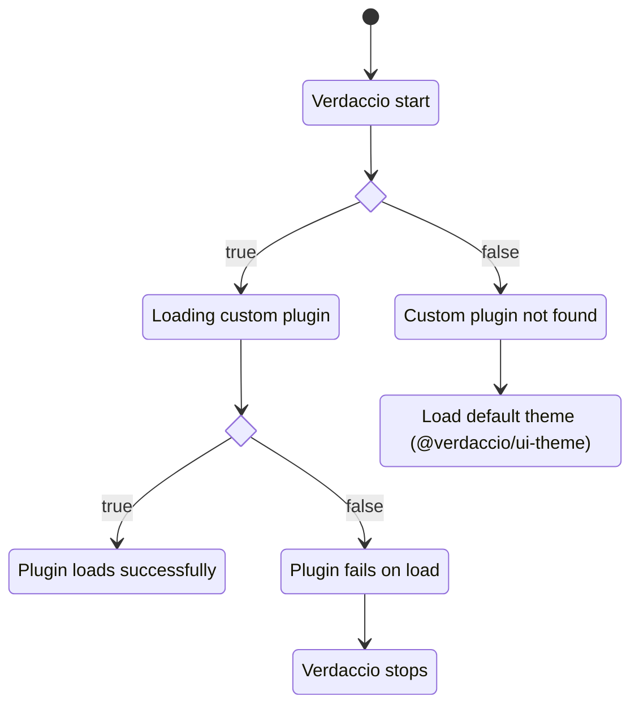

## What's a theme plugin? {#whats-a-theme-plugin}

Verdaccio uses by default a [custom UI](https://www.npmjs.com/package/@verdaccio/ui-theme) that provides a good set of feature to visualize the packages, but might be case your team needs some custom extra features and here is where a custom theme is an option. The plugin store static assets that will be loaded in the client side when the page is being rendered.

### How a theme plugin load phase works?



### How the assets of the theme loads? {#loads}

:::caution

By default the application loads on `http://localhost:4873`, but in cases where a resverse proxy with custom domain are involved the assets are loaded based on the property `__VERDACCIO_BASENAME_UI_OPTIONS.base` and `__VERDACCIO_BASENAME_UI_OPTIONS.basename`, thus only one domain configuration can be used.

:::

The theme loads only in the client side, the application renders HTML with `<script>` tags to render the application, the bundler takes care of load any other assets as `svg`, `images` or _chunks_ associated with it.

### The `__VERDACCIO_BASENAME_UI_OPTIONS` object

`window.__VERDACCIO_BASENAME_UI_OPTIONS` is available in the browser global context. Its
shape is the `TemplateUIOptions` type, defined in
[`@verdaccio/types`](https://github.com/verdaccio/verdaccio/blob/master/packages/core/types/src/configuration.ts):

```ts
type TemplateUIOptions = {
  uri?: string;
  protocol?: string;
  host?: string;
  base: string;
  basename?: string; // deprecated, use base
  version?: string;
  flags?: FlagsConfig;
} & CommonWebConf;
```

`CommonWebConf` carries what the `web` block of `config.yaml` sets — `title`, `logo`,
`logoDark`, `favicon`, `darkMode`, `language`, `login`, `scope`, `pkgManagers`,
`sort_packages`, and the `show*` toggles (`showInfo`, `showSettings`, `showSearch`,
`showFooter`, `showThemeSwitch`, `showDownloadTarball`, `showUplinks`).

```js
// output example
{
    "darkMode": false,
    "base": "https://registry.my.org/",
    "primaryColor": "#4b5e40",
    "version": "9.0.0",
    "pkgManagers": ["yarn", "pnpm", "npm"],
    "login": true,
    "logo": "",
    "title": "Verdaccio Registry",
    "scope": "",
    "language": "en-US"
}
```

### Theme Configuration {#theme-configuration}

By default verdaccio loads the `@verdaccio/ui-theme` which is bundled in the main package, if you want to load your custom plugin has to be installed where could be found.

```bash

$> npm install --global verdaccio-theme-dark

```

:::caution
The plugin name prefix must start with `verdaccio-theme-xxx`, otherwise the plugin will be ignored.
:::

You can load only **one theme at a time (if more are provided the first one is being selected)** and pass through options if you need it.

```yaml
theme:
  dark:
    option1: foo
    option2: bar
```

These options will be available

### Plugin structure {#build-structure}

If you have a custom user interface theme has to follow a specific structure:

```
{
  "name": "verdaccio-theme-xxxx",
  "version": "1.0.0",
  "description": "my custom user interface",
  "main": "index.js",
}
```

The main file `index.js` file should contain the following content.

```
module.exports = () => {
  return {
    // location of the static files, webpack output
    staticPath: path.join(__dirname, 'static'),
    // webpack manifest json file
    manifest: require('./static/manifest.json'),
    // main manifest files to be loaded
    manifestFiles: {
      js: ['runtime.js', 'vendors.js', 'main.js'],
    },
  };
};
```

If any of the following properties are not available, the plugin won't load, thus follow this structure.

- `staticPath`: is the absolute/relative location of the statics files, could be any path either with `require.resolve` or build your self, what's important is inside of the package or any location that the Express.js middleware is able to find, behind the scenes the [`res.sendFile`](https://expressjs.com/en/api.html#res.sendFile) is being used.
- `manifest`: A Webpack manifest object.
- `manifestFiles`: A object with one property `js` and the array (order matters) of the manifest id to be loaded in the template dynamically.
- The `manifestFiles` refers to the main files must be loaded as part of the `html` scripts in order to load the page, you don't have to include the _chunks_ since are dynamically loaded by the bundler.

#### Manifest file {#manifest-and-webpack}

Verdaccio resolves each entry in `manifestFiles` against the `manifest` object and injects
the result into the HTML. The lookup is a plain property access — `manifest[name]` — and the
value has to be a **string path**:

```json
{
  "main.js": "/-/static/main.4f2a1c.js",
  "main.css": "/-/static/main.9b3e77.css",
  "favicon.ico": "/-/static/favicon.ico"
}
```

So there is **one supported manifest shape**, not one per bundler: a flat map from name to
path. `manifestFiles.js` and `.css` are arrays of keys into it, `.ico` a single key, and
order matters for `js`.

#### Any bundler works, as long as it emits that shape {#manifest-bundlers}

`webpack-manifest-plugin` produces it directly, which is why it is the usual example:

```js
const { WebpackManifestPlugin } = require('webpack-manifest-plugin');

plugins: [
  new WebpackManifestPlugin({
    // optional, depends on your implementation
    removeKeyHash: true,
  }),
];
```

**Vite's built-in manifest does not.** With `build.manifest`, Vite emits entries keyed by
source path whose values are _objects_ (`{ file, imports, css }`), so `manifest[name]` gives
you `[object Object]` in the `<script src>`.

The default theme is built with Vite and solves this with a small `generateBundle` plugin
that writes the flat shape itself — read
[`vite.config.mjs`](https://github.com/verdaccio/verdaccio/blob/master/packages/plugins/ui-theme/vite.config.mjs)
in `@verdaccio/ui-theme`, it is about thirty lines and it is the reference for any bundler
Verdaccio does not document.

Its [`index.js`](https://github.com/verdaccio/verdaccio/blob/master/packages/plugins/ui-theme/index.js)
is worth reading next to it: rather than hardcoding a file list, it derives `manifestFiles`
from the manifest keys, so a hash change never needs a code change.

## Components UI {#components}

Building a user interface from scratch is a big effort, so the pieces the default theme is
made of are published on their own as
[`@verdaccio/ui-components`](https://www.npmjs.com/package/@verdaccio/ui-components)
([source](https://github.com/verdaccio/verdaccio/tree/master/packages/ui-components)).
They are built with **React** and **Material UI**.

The package exports the parts that can be reused:

- React hooks
- Providers (React Context API)
- Components
- Sections: **Sidebar, Detail, Header, Home Page and Footer**

Pick the release line that matches your Verdaccio: the `next-9` tag tracks Verdaccio 9,
`next-7` tracks Verdaccio 7, and `6-next` tracks Verdaccio 6.

:::note
The components are published for reuse but their API is not frozen, and there is no
separate documentation site for them — read the source, or the default theme
([`@verdaccio/ui-theme`](https://github.com/verdaccio/verdaccio/tree/master/packages/plugins/ui-theme))
as the reference consumer. **Feedback is welcome.**
:::
