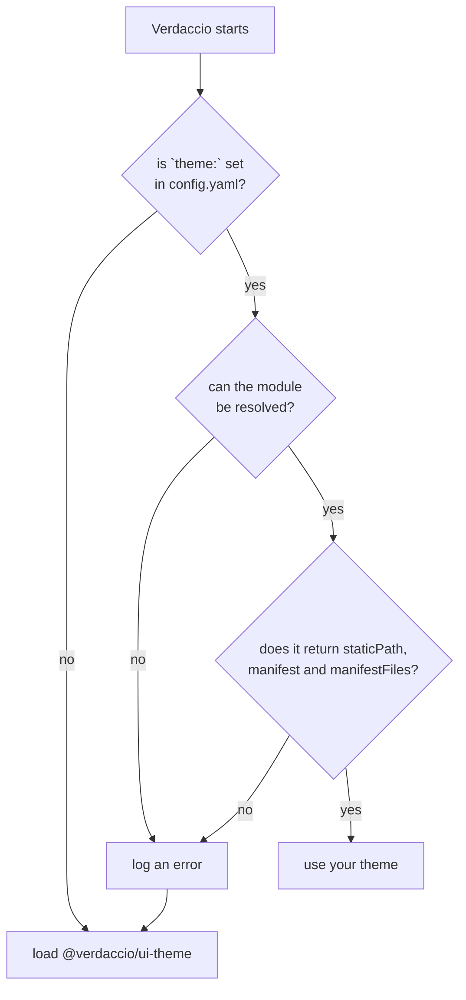

## What's a theme plugin? {#whats-a-theme-plugin}

Verdaccio uses by default a [custom UI](https://www.npmjs.com/package/@verdaccio/ui-theme) that provides a good set of feature to visualize the packages, but might be case your team needs some custom extra features and here is where a custom theme is an option. The plugin store static assets that will be loaded in the client side when the page is being rendered.

### How a theme plugin is loaded {#load-phase}



**A theme that fails to load does not stop Verdaccio.** Whatever goes wrong — the package is
not installed, the name is misspelled, the export is missing a required property — the loader
writes one line to the log and moves on, and the web UI comes up with the **default theme**.
The startup then reports `plugin @verdaccio/ui-theme successfully loaded`, which is true and
also exactly what you would see if your plugin had never been configured.

So when a custom theme "does nothing", read the log rather than the screen. The two lines to
look for are:

```
error  <name> doesn't look like a valid plugin
error  package not found, try to install <name> with a package manager
```

Two more rules the loader applies:

- The package name must start with **`verdaccio-theme-`**, unless `server.pluginPrefix`
  says otherwise. Anything else is not even looked up.
- Only **one** theme is used. Configuring several logs
  `multiple ui themes are not supported; only the first plugin is used` and takes the first.

The validity check is exactly this — all three properties, or the plugin is discarded:

```js
plugin.staticPath && plugin.manifest && plugin.manifestFiles;
```

### How the assets of the theme loads? {#loads}

:::caution

By default the application loads on `http://localhost:4873`, but in cases where a resverse proxy with custom domain are involved the assets are loaded based on the property `__VERDACCIO_BASENAME_UI_OPTIONS.base` and `__VERDACCIO_BASENAME_UI_OPTIONS.basename`, thus only one domain configuration can be used.

:::

The theme loads only in the client side, the application renders HTML with `<script>` tags to render the application, the bundler takes care of load any other assets as `svg`, `images` or _chunks_ associated with it.

### The `__VERDACCIO_BASENAME_UI_OPTIONS` object

`window.__VERDACCIO_BASENAME_UI_OPTIONS` is available in the browser global context. Its
shape is the `TemplateUIOptions` type, defined in
[`@verdaccio/types`](https://github.com/verdaccio/verdaccio/blob/master/packages/core/types/src/configuration.ts):

```ts
type TemplateUIOptions = {
  uri?: string;
  protocol?: string;
  host?: string;
  base: string;
  basename?: string; // deprecated, use base
  version?: string;
  flags?: FlagsConfig;
} & CommonWebConf;
```

`CommonWebConf` carries what the `web` block of `config.yaml` sets — `title`, `logo`,
`logoDark`, `favicon`, `darkMode`, `language`, `login`, `scope`, `pkgManagers`,
`sort_packages`, and the `show*` toggles (`showInfo`, `showSettings`, `showSearch`,
`showFooter`, `showThemeSwitch`, `showDownloadTarball`, `showUplinks`).

```js
// output example
{
    "darkMode": false,
    "base": "https://registry.my.org/",
    "primaryColor": "#4b5e40",
    "version": "9.0.0",
    "pkgManagers": ["yarn", "pnpm", "npm"],
    "login": true,
    "logo": "",
    "title": "Verdaccio Registry",
    "scope": "",
    "language": "en-US"
}
```

### Theme Configuration {#theme-configuration}

By default verdaccio loads the `@verdaccio/ui-theme` which is bundled in the main package, if you want to load your custom plugin has to be installed where could be found.

```bash

$> npm install --global verdaccio-theme-dark

```

:::caution
The plugin name prefix must start with `verdaccio-theme-xxx`, otherwise the plugin will be ignored.
:::

You can load only **one theme at a time (if more are provided the first one is being selected)** and pass through options if you need it.

```yaml
theme:
  dark:
    option1: foo
    option2: bar
```

These options will be available

### Plugin structure {#build-structure}

If you have a custom user interface theme has to follow a specific structure:

```
{
  "name": "verdaccio-theme-xxxx",
  "version": "1.0.0",
  "description": "my custom user interface",
  "main": "index.js",
}
```

The main file `index.js` file should contain the following content.

```
module.exports = () => {
  return {
    // location of the static files, webpack output
    staticPath: path.join(__dirname, 'static'),
    // webpack manifest json file
    manifest: require('./static/manifest.json'),
    // main manifest files to be loaded
    manifestFiles: {
      js: ['runtime.js', 'vendors.js', 'main.js'],
    },
  };
};
```

If any of the following properties are not available, the plugin won't load, thus follow this structure.

- `staticPath`: is the absolute/relative location of the statics files, could be any path either with `require.resolve` or build your self, what's important is inside of the package or any location that the Express.js middleware is able to find, behind the scenes the [`res.sendFile`](https://expressjs.com/en/api.html#res.sendFile) is being used.
- `manifest`: A Webpack manifest object.
- `manifestFiles`: A object with one property `js` and the array (order matters) of the manifest id to be loaded in the template dynamically.
- The `manifestFiles` refers to the main files must be loaded as part of the `html` scripts in order to load the page, you don't have to include the _chunks_ since are dynamically loaded by the bundler.

#### Manifest file {#manifest-and-webpack}

Verdaccio resolves each entry in `manifestFiles` against the `manifest` object and injects
the result into the HTML. The lookup is a plain property access — `manifest[name]` — and the
value has to be a **string path**:

```json
{
  "main.js": "/-/static/main.4f2a1c.js",
  "main.css": "/-/static/main.9b3e77.css",
  "favicon.ico": "/-/static/favicon.ico"
}
```

So there is **one supported manifest shape**, not one per bundler: a flat map from name to
path. `manifestFiles.js` and `.css` are arrays of keys into it, `.ico` a single key, and
order matters for `js`.

#### Any bundler works, as long as it emits that shape {#manifest-bundlers}

`webpack-manifest-plugin` produces it directly, which is why it is the usual example:

```js
const { WebpackManifestPlugin } = require('webpack-manifest-plugin');

plugins: [
  new WebpackManifestPlugin({
    // optional, depends on your implementation
    removeKeyHash: true,
  }),
];
```

**Vite's built-in manifest does not.** With `build.manifest`, Vite emits entries keyed by
source path whose values are _objects_ (`{ file, imports, css }`), so `manifest[name]` gives
you `[object Object]` in the `<script src>`.

The default theme is built with Vite and solves this with a small `generateBundle` plugin
that writes the flat shape itself — read
[`vite.config.mjs`](https://github.com/verdaccio/verdaccio/blob/master/packages/plugins/ui-theme/vite.config.mjs)
in `@verdaccio/ui-theme`, it is about thirty lines and it is the reference for any bundler
Verdaccio does not document.

Its [`index.js`](https://github.com/verdaccio/verdaccio/blob/master/packages/plugins/ui-theme/index.js)
is worth reading next to it: rather than hardcoding a file list, it derives `manifestFiles`
from the manifest keys, so a hash change never needs a code change.

## Web endpoints {#web-endpoints}

A theme runs in the browser, so everything it shows comes from a small set of **web endpoints**
that exist for the user interface. They are separate from the npm registry API that package
managers use, they are what the default theme calls, and they are the contract a custom theme can
build on.

:::note
The routes below are the same on the 6.x line and on later ones. The request and response details
were checked against the current code, and the few differences between lines are marked.
:::

Build every URL from `base` in [`__VERDACCIO_BASENAME_UI_OPTIONS`](#the-__verdaccio_basename_ui_options-object)
instead of hardcoding `/`: it already includes the domain and the `url_prefix` when Verdaccio runs
behind a reverse proxy, and it ends with a `/`.

### What Verdaccio serves for your theme {#web-routes}

| Path                      | What it returns                                                                                    |
| ------------------------- | -------------------------------------------------------------------------------------------------- |
| `/` and `/-/web/*`        | The HTML page that loads your theme. Every client-side route of your app can live under `/-/web/`. |
| `/-/static/*`             | The files in your plugin's `staticPath`.                                                           |
| `/-/static/ui-options.js` | A script that defines `window.__VERDACCIO_BASENAME_UI_OPTIONS`. It is never cached.                |
| `/-/assets/*`             | The files in `web.assetFolder`, only when that option is set (7.x and later).                      |
| `/-/verdaccio/data/*`     | The [data endpoints](#web-data): packages, search, package details and README.                     |
| `/-/verdaccio/sec/*`      | The [security endpoints](#web-sec): login, sign up and change password.                            |

### Authentication {#web-auth}

- Requests are **anonymous** unless they carry a token. After a successful login, send
  `Authorization: Bearer <token>` with every request, using the `token` the login endpoint returned.
- The same access rules as the registry apply, so a user only sees the packages the `access` rules
  allow, see [package access](/docs/packages#groups). Packages that are not allowed are left out
  of the lists, and a direct request for one answers `403`.
- With `web.login: false` the security endpoints are not available and the package pages are
  evaluated as an anonymous user.

### Data endpoints {#web-data}

All of them are `GET` and answer JSON, except the README.

| Endpoint                                    | Purpose                                  |
| ------------------------------------------- | ---------------------------------------- |
| `/-/verdaccio/data/packages`                | The packages the user can see.           |
| `/-/verdaccio/data/search/:text`            | Search the packages, 20 results at most. |
| `/-/verdaccio/data/sidebar/:package`        | The details of one package.              |
| `/-/verdaccio/data/package/readme/:package` | The README of one package, as text.      |

Scoped packages keep the `@` in the path, for example `/-/verdaccio/data/sidebar/@verdaccio/ui`.
`sidebar` and `readme` accept `?v=` with a **version or a dist-tag**; anything else answers `404`.

These endpoints are rate limited, by default to 5000 requests every 2 minutes per client. Change
it with `web.rateLimit` (`windowMs` and `max`), see the [web configuration](/docs/webui).

#### `GET /-/verdaccio/data/packages` {#web-packages}

An array with one entry per package: the fields of its latest version (always `name` and `version`,
plus whatever its `package.json` provides, such as `description` and `author`). The `author` is
normalised to `{ name, email, avatar }`, and `dist.tarball` points to this registry. The list is
sorted by name, in the direction set by `web.sort_packages`.

```json
[
  {
    "name": "@verdaccio/ui",
    "version": "2.4.0",
    "description": "Shared React components",
    "author": { "name": "Jane Doe", "email": "jane@verdaccio.dev", "avatar": "https://…" },
    "dist": { "tarball": "https://registry.example.com/@verdaccio/ui/-/ui-2.4.0.tgz" }
  }
]
```

#### `GET /-/verdaccio/data/search/:text` {#web-search}

An array of search results, shaped like the entries of the npm search endpoint: each one has a
`package` object with at least `name`, `version` and `description`. It returns at most 20 results
and only the packages the user is allowed to see.

#### `GET /-/verdaccio/data/sidebar/:package` {#web-sidebar}

The manifest of the package, without `readme`, `_attachments`, `_rev` and `name` (the name is the
one in the URL), plus a `latest` object with the version that was asked for. `latest` is the
version or dist-tag in `?v=`, or else `dist-tags.latest`, or else the highest version. `author` is
normalised as above and every `dist.tarball` points to this registry.

```json
{
  "latest": {
    "version": "2.4.0",
    "description": "Shared React components",
    "license": "MIT",
    "author": { "name": "Jane Doe", "email": "jane@verdaccio.dev", "avatar": "https://…" },
    "dependencies": { "react": "^19.0.0" },
    "dist": { "tarball": "https://registry.example.com/@verdaccio/ui/-/ui-2.4.0.tgz" }
  },
  "dist-tags": { "latest": "2.4.0", "next": "3.0.0-beta.1" },
  "versions": { "2.4.0": {}, "2.3.1": {} },
  "time": { "2.4.0": "2026-09-01T10:00:00.000Z" }
}
```

`versions` holds the full manifest of every version, and `_uplinks` is present when the package
comes from an uplink. Treat any field that comes from `package.json` as optional.

#### `GET /-/verdaccio/data/package/readme/:package` {#web-readme}

The README as **Markdown**, with `Content-Type: text/plain; charset=utf-8`, not JSON. Verdaccio
looks for it in the requested version, then in the latest version, then in the package itself.
When there is none the answer is still `200` with the text `ERROR: No README data found!`.

### Security endpoints {#web-sec}

They exist only when the web login is enabled (`web.login` is not `false`).

| Endpoint                              | Available when                               | Purpose                   |
| ------------------------------------- | -------------------------------------------- | ------------------------- |
| `POST /-/verdaccio/sec/login`         | always                                       | Log in and get a token.   |
| `PUT /-/verdaccio/sec/signup`         | the [`createUser`][create-user] flag         | Create a user.            |
| `PUT /-/verdaccio/sec/reset_password` | the [`changePassword`][change-password] flag | Change your own password. |

[create-user]: /docs/user-registration
[change-password]: /docs/change-password

#### `POST /-/verdaccio/sec/login` {#web-login}

Send the credentials as JSON, as the default theme does, or as a form.

```json
{ "username": "jane", "password": "secret" }
```

A successful login answers `200` with the token to send as a bearer token from then on. The
response is never cached.

```json
{ "username": "jane", "token": "<web token>" }
```

Wrong credentials answer `401` with `WWW-Authenticate: Bearer`, which keeps the browser from
opening its own basic authentication dialog, so your theme can show the error itself. The
endpoint has its own rate limit, `userRateLimit`.

#### `PUT /-/verdaccio/sec/signup` {#web-signup}

Body `{ "name", "password", "email", "sessionId" }`, where `sessionId` is a 36 character string
your theme generates. It answers `{ "username", "token" }` like the login. A missing field or an
invalid `sessionId` is a `400`. The same call is used by the
[web login](/docs/web-login) flow, where a `202` with `Retry-After: 5` means the user has not
finished yet and the call should be repeated.

#### `PUT /-/verdaccio/sec/reset_password` {#web-reset-password}

Needs a token. The body is `{ "password": { "old": "…", "new": "…" } }` and the answer is
`{ "ok": true }`. Without a token it answers `401`, and a new password that does not match
`server.passwordValidationRegex` is a `400`.

### Errors {#web-errors}

| Status | When                                                                                         |
| ------ | -------------------------------------------------------------------------------------------- |
| `401`  | Wrong credentials on login, or no token on an endpoint that needs one.                       |
| `403`  | The user is not allowed to access that package.                                              |
| `404`  | The package name is not valid, the package does not exist, or `?v=` is not a version or tag. |
| `429`  | The rate limit was exceeded.                                                                 |

### A minimal client {#web-example}

```ts
const { base } = window.__VERDACCIO_BASENAME_UI_OPTIONS;
const api = (path: string, token?: string) =>
  fetch(`${base}-/verdaccio/${path}`, {
    headers: token ? { Authorization: `Bearer ${token}` } : {},
  });

// log in, then ask for what the user can see
const login = await fetch(`${base}-/verdaccio/sec/login`, {
  method: 'POST',
  headers: { 'Content-Type': 'application/json' },
  body: JSON.stringify({ username: 'jane', password: 'secret' }),
});
const { token } = await login.json();

const packages = await (await api('data/packages', token)).json();
const detail = await (await api('data/sidebar/@verdaccio/ui?v=next', token)).json();
const readme = await (await api('data/package/readme/@verdaccio/ui', token)).text();
```

The default theme also uses two registry endpoints that are not part of the web API: the npm login
flow at `/-/v1/login_cli`, and `/-/npm/v1/user` to change the password.
You do not need to write these calls yourself: [`@verdaccio/ui-components`](ui-components.md)
already implements them as hooks and providers.

## Components UI {#components}

Building a user interface from scratch is a big effort, so the pieces the default theme is
made of are published on their own as `@verdaccio/ui-components` — React hooks, providers,
components and whole sections (sidebar, header, detail, home, footer).

See [UI Components](ui-components.md) for installation, requirements and a worked example.
