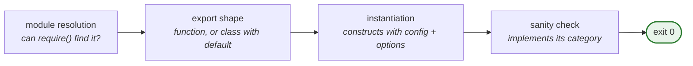

`@verdaccio/plugin-verifier` answers one question: **would Verdaccio start with this plugin?**

It does not simulate the answer. It calls `asyncLoadPlugin` from `@verdaccio/loaders` — the
same loader the registry runs at boot — so passing here means the plugin loads in production.

```bash
npx verdaccio-plugin-verifier my-auth --category authentication
```

Exit code `0` means loaded and valid, `1` means it failed. That is all CI needs.

## What it checks {#checks}

The four stages the registry goes through at boot:



The last stage requires at least one method per category:

| Category         | Required methods                                  |
| ---------------- | ------------------------------------------------- |
| `authentication` | `authenticate`, `allow_access` or `allow_publish` |
| `storage`        | `getPackageStorage`                               |
| `middleware`     | `register_middlewares`                            |
| `filter`         | `filter_metadata`                                 |

## What it does **not** check {#limits}

It verifies that your plugin **loads**, not that it **works**. A `getPackageStorage` returning
nonsense passes. Treat it as the boot check it is, and cover behaviour with your own tests.

## Resolving the plugin {#resolution}

By default the name is resolved from `node_modules` with the `verdaccio-` prefix, exactly as
the registry does — `my-auth` looks for `verdaccio-my-auth`. Scoped names are used as given.

| Option                   | What it does                                                             |
| ------------------------ | ------------------------------------------------------------------------ |
| `--category`, `-c`       | **required** — `authentication`, `storage`, `middleware` or `filter`     |
| `--plugins-folder`, `-d` | absolute path to a plugins directory, the equivalent of `config.plugins` |
| `--prefix`, `-p`         | a different prefix, default `verdaccio`                                  |

With `--plugins-folder`, the folder itself has to carry the prefix, matching how Verdaccio
resolves plugins from disk:

```
plugins/
  verdaccio-my-auth/
    index.js
    package.json
```

## In CI {#ci}

```yaml
- name: Verify plugin
  run: npx verdaccio-plugin-verifier my-auth --category authentication --plugins-folder ./build
```

Worth running on every build: it catches a broken `default` export or a renamed method before
anyone installs the plugin, and it is fast enough that there is no reason not to.

## From a test {#programmatic}

```ts
import { PLUGIN_CATEGORY } from '@verdaccio/core';
import { verifyPlugin } from '@verdaccio/plugin-verifier';

const result = await verifyPlugin({
  pluginPath: 'my-auth',
  category: PLUGIN_CATEGORY.AUTHENTICATION,
});

expect(result.success).toBe(true);
```

`result` also carries `pluginsLoaded` and, on failure, `error`.

## Already wired for you {#generator}

Projects created with the [plugin generator](plugin-generator.md) ship a `verify` script
pointing at the right category, so `npm run verify` works from the first commit.

The full option list lives in the
[package README](https://github.com/verdaccio/verdaccio/tree/master/packages/tools/plugin-verifier).
